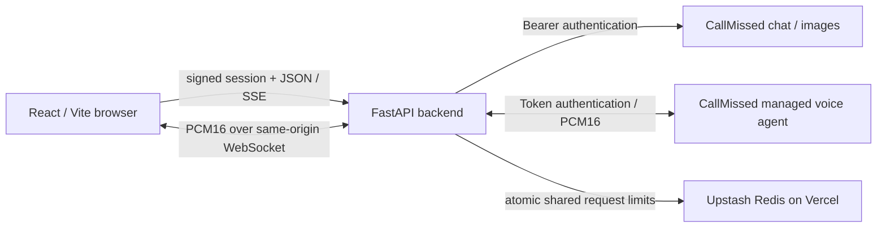

# CallMissed AI Playground

A Python backend assessment project by Mevin Benty: one workspace for streaming AI chat, text-to-image generation, and real-time voice conversations. Every AI request uses CallMissed. The API key stays on the server.

**Repository:** https://github.com/Mevinb/CallMissed  
**Hosted application:** deployment pending account authentication and production environment configuration.  
**Verification:** mocked backend and frontend tests pass; live CallMissed inference, browser audio playback, Docker execution, and public deployment have not yet been verified. See [verification notes](docs/VERIFICATION.md).

## Features

- **Chat:** streamed Markdown answers, conversation context, prompt starters, copy answer, cancel response, new conversation, loading and error states. History stays in the current browser tab.
- **Image Studio:** real CallMissed base64 image responses, dimension presets, prompt starters, six-image history, reuse prompt, fullscreen preview, download and clear history. Images are stored in IndexedDB for the current tab for up to 24 hours.
- **Voice Agent:** microphone capture with an AudioWorklet, 24 kHz mono PCM16 encoding, bidirectional WebSocket audio, continuous playback, interruption handling, live transcripts, mute, stop, and explicit connection states. Calls last at most four minutes.
- **Backend security:** signed HttpOnly session cookie, reviewer access code, explicit origin checks, shared rate limits on Vercel, fixed provider endpoints and server-selected models, bounded input, timeouts, sanitized errors and key redaction.
- **Deployment:** a single FastAPI/Vite application for Vercel, a non-root Docker image, Compose with Caddy HTTPS for EC2, and GitHub Actions checks.

No simulated AI responses, sample generated images, or prerecorded voice conversations are included in the application. Test fixtures are confined to automated tests.

## Architecture



The frontend uses relative `/api` URLs. In development Vite proxies these to Python. In production frontend and API share one origin, so the browser never needs the CallMissed key or a cross-site session cookie. Vercel Fluid Compute serves the FastAPI WebSocket endpoint; this is a currently documented beta capability and must be verified on the deployed project.

## Stack

Python 3.12, FastAPI, Uvicorn, Pydantic Settings, HTTPX, websockets, itsdangerous, Pytest; React 19, TypeScript, Vite, Tailwind CSS 4, Lucide, self-hosted Manrope, react-markdown, Vitest and Testing Library.

## Screenshots

Screenshots are pending a real browser review. After live testing, capture the chat workspace, a genuinely generated image, and a voice session into `docs/screenshots/`. Exclude credentials and personal transcripts. No mock screenshot is presented as evidence of a working integration.

## Prerequisites

- Python 3.12 or later; Node.js 22 and npm.
- A CallMissed key with `llm`, `image`, `stt`, and `tts` permissions and sufficient credits. A free-plan model is eligible for the free plan; it can still consume credits.
- A current browser supporting AudioContext, AudioWorklet, WebSocket and microphone access. Voice requires HTTPS or localhost.
- Docker and Docker Compose for the container setup; optional locally.

## Local setup

```bash
git clone https://github.com/Mevinb/CallMissed.git
cd CallMissed
python3 -m venv .venv
source .venv/bin/activate
pip install -r requirements-dev.txt
cp .env.example .env
npm --prefix frontend ci
```

Edit `.env` locally and set `CALLMISSED_API_KEY`. Keep it out of chat, screenshots, shell history and version control. Do not rename it to a `VITE_` variable.

Run the backend in one terminal:

```bash
source .venv/bin/activate
uvicorn backend.app.main:app --host 127.0.0.1 --port 8000 --reload --ws-max-size 8192 --no-access-log
```

Run the frontend in another:

```bash
npm --prefix frontend run dev
```

Open **http://localhost:5173**. Development mode allows local sessions without an access code when `DEMO_ACCESS_CODE` is blank. An absent API key produces an explicit setup message and API errors; it never enables mock answers. Local API docs are at http://localhost:8000/api/docs.

To serve the built frontend from Python at **http://localhost:8000**:

```bash
./scripts/run-local.sh
```

## Environment variables

| Variable | Purpose | Default / requirement |
|---|---|---|
| `CALLMISSED_API_KEY` | Backend provider credential | Required for inference; never sent to the browser |
| `APP_ENV` | `development` or `production` | `development`; set `production` when hosted |
| `APP_ORIGINS` | Comma-separated exact browser origins | Localhost defaults; explicit HTTPS origin(s) in production |
| `SESSION_SECRET` | Session signature secret | Random on each local process start if blank; at least 32 characters in production |
| `DEMO_ACCESS_CODE` | Private reviewer login code | Optional locally; at least 12 characters in production |
| `CHAT_MODEL` | Server-selected chat model | `sarvam-105b` |
| `IMAGE_MODEL` | Server-selected image model | `sdxl-lightning` |
| `VOICE_LLM_MODEL` | Voice language model | `gpt-oss-120b` |
| `VOICE_STT_MODEL` | Streaming speech recognition | `saaras:v3` |
| `VOICE_TTS_MODEL` | Speech synthesis | `bulbul:v3` |
| `VOICE_NAME` / `VOICE_LANGUAGE` | Voice and recognition language | `shubh` / `en-IN` |
| `VOICE_MAX_SECONDS` | Maximum demo call duration | `240`; range 30–240 |
| `UPSTASH_REDIS_REST_URL` | Shared Redis rate-limit URL | Required for production on Vercel |
| `UPSTASH_REDIS_REST_TOKEN` | Redis credential | Required with Redis; backend only |
| `GLOBAL_DAILY_REQUESTS` | Shared total inference/start allowance | `200`; includes failed attempts |
| `PORT` | Uvicorn container port | `8000` |
| `APP_DOMAIN` | Caddy HTTPS hostname for EC2 | Only for `compose.production.yaml` |

Generate `SESSION_SECRET` with `python3 -c 'import secrets; print(secrets.token_urlsafe(48))'`. Use a separate strong reviewer access code and share it privately. Vercel sets `VERCEL` automatically; production configuration refuses to start without shared rate-limit storage there.

## API integration

Read and verified against the official documentation on October 1, 2026:

| Application route | CallMissed integration |
|---|---|
| `POST /api/chat` | `POST https://api.callmissed.com/v1/chat/completions`, Bearer key, `messages`, `model`, `stream`, `max_tokens`; normalized SSE `token`, `done`, `error` events or JSON with `stream:false` |
| `POST /api/images` | `POST https://api.callmissed.com/v1/images/generations`, Bearer key, one image, `response_format:b64_json`; validates PNG/JPEG and returns only image data and model |
| `WS /api/voice` | Server connects to `wss://api.callmissed.com/v2/voice/agent` with `Authorization: Token`; sends native `Settings` after `Welcome`; relays audio only after `SettingsApplied` |
| `GET /api/health` | Local process health and configuration flag; does not call CallMissed or attest that the key is valid |
| `GET/POST/DELETE /api/session` | Local access/session handling; no provider call |

Voice uses raw little-endian signed 16-bit PCM, mono, 24 kHz in both directions. The browser resamples the microphone's actual sample rate and schedules audio buffers continuously. `UserStartedSpeaking` cancels queued playback; `AgentAudioDone` is not treated as playback completion. All API key authentication occurs on the server. No direct browser-to-provider connection is used.

The managed API's event names and native settings are documented by CallMissed. The `ConversationText` fields `role` and `content` follow the documented Deepgram-compatible event contract; malformed or unsupported events are never fabricated into transcripts. Live confirmation remains required.

Official references: [authentication](https://docs.callmissed.com/docs/authentication), [chat](https://docs.callmissed.com/docs/chat-completion), [streaming](https://docs.callmissed.com/docs/chat-streaming), [images](https://docs.callmissed.com/docs/image-generation), [managed voice](https://docs.callmissed.com/docs/managed-voice-agent), [compatible transcript event](https://developers.deepgram.com/docs/voice-agent-conversation-text).

## Testing

```bash
source .venv/bin/activate
pytest -q
ruff check backend
ruff format --check backend
npm --prefix frontend test
npm --prefix frontend run build
```

Backend tests use HTTPX MockTransport and a fake upstream voice socket; no external credentials or paid calls are needed. Frontend tests exercise navigation, streamed answers, error handling, access control and microphone denial; PCM tests check resampling and signed encoding. These tests do not prove provider availability, microphone hardware, perceptual audio quality or public hosting.

With your API key configured, run an actual provider smoke check separately:

```bash
python -m scripts.smoke_provider
# Image mode uses actual credits and writes a generated image to /tmp.
python -m scripts.smoke_provider --image
# Checks the real voice handshake, settings, and receipt of greeting audio.
python -m scripts.smoke_provider --voice
```

See [manual acceptance](docs/ACCEPTANCE.md) for browser and hosted voice checks. A smoke check is not a substitute for hearing and interrupting the agent yourself.

## Docker

```bash
docker compose up --build -d
curl http://localhost:8000/api/health
docker compose down
```

Uses `.env` at runtime; the build context excludes it. The multi-stage build compiles Vite and then runs one Uvicorn worker as a non-root user. The app container has no writable filesystem except a small `/tmp`. No GPU or local model installation is needed.

## Deployment

**Preferred: Vercel**, using the repository root, FastAPI framework preset, Python 3.12, Node.js 22, Fluid Compute, and the provided `vercel.json` / `pyproject.toml`. Configure secrets in project environment settings. The application and API use one public HTTPS hostname. Shared request limits use Upstash Redis REST; no prompts or audio are stored in Redis.

Detailed steps and the AWS EC2 + Caddy fallback are in [deployment guide](docs/DEPLOYMENT.md). See [publication steps](docs/PUBLISH.md) for the remaining GitHub/account actions. Public hosting remains pending; there is no invented hosted URL in this README.

## Limits and tradeoffs

- Chat: up to 40 messages, 8,000 characters per message and 40,000 per request; up to 2,048 output tokens. New chat clears local history.
- Images: one generation per request, at most 3 MB decoded. Larger/invalid images fail with a useful error to stay inside Vercel response-size limits; no arbitrary image URL proxy or SVG rendering.
- Per-session limits: 20 chat requests/minute, 3 image requests/minute and 3 voice starts/hour. Login allows 10 attempts/minute per server-observed client address. Global daily requests are shared with Redis. Fixed windows can permit a burst near a boundary.
- Voice: four minutes maximum, handshake deadline, bounded frame sizes, audio throughput limit and a maximum of four local active relays. One active voice session per browser session is enforced within a worker; the CallMissed account's concurrent-session limit is authoritative across Vercel instances. Multi-instance duplicate-session prevention would require a distributed lease.
- Without Redis, limits are in process memory: use exactly one Uvicorn worker on EC2 and expect limits to reset after a restart. Vercel production requires Redis and fails closed when the limit service is unavailable.
- The reviewer code is intentionally simple demo authentication, not a multi-user identity platform. Locking removes the browser cookie; stolen cookies remain valid until their eight-hour expiry unless the session secret is rotated. Logging out stops local voice immediately.
- No automatic retry of inference or voice reconnection: duplicate requests can spend credits or create overlapping sessions. Choose another model explicitly when a configured model is unavailable.
- Providers may round image dimensions. The selected dimensions shown in history describe the request, not an independently measured pixel count.
- Keep the CallMissed key's own budget/credit limits enabled. App limits are request allowances, not a monetary budget.

## Project layout

```text
backend/app/
  config.py, models.py, security.py, errors.py, main.py
  routes/       chat, images, voice
  services/     HTTP/SSE provider client and WebSocket voice relay
backend/tests/  isolated backend tests
frontend/src/
  components/   Chat, ImageStudio, VoiceAgent, Shared
  api.ts        API client, SSE reader, IndexedDB history
  useVoice.ts   microphone, connection and playback lifecycle
frontend/public/pcm-capture.js
scripts/        local launcher and live provider smoke checks
deploy/         Caddy HTTPS configuration
docs/           deployment, acceptance and verification
```

The assignment submission email will be prepared after Mevin has tested and approved the application. It will not be sent automatically.
